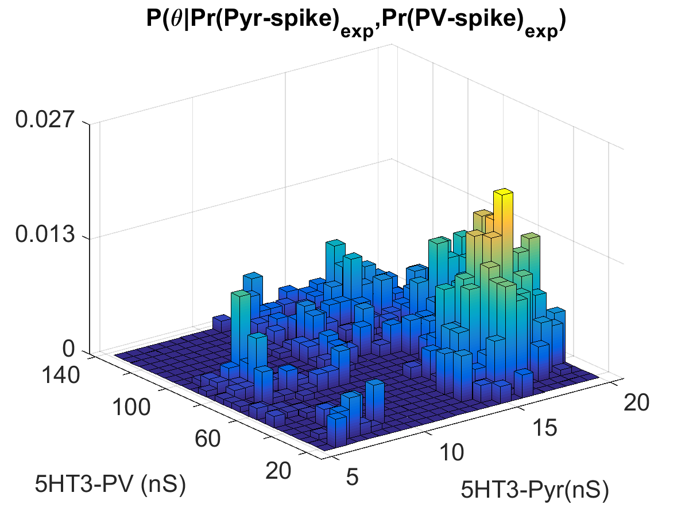
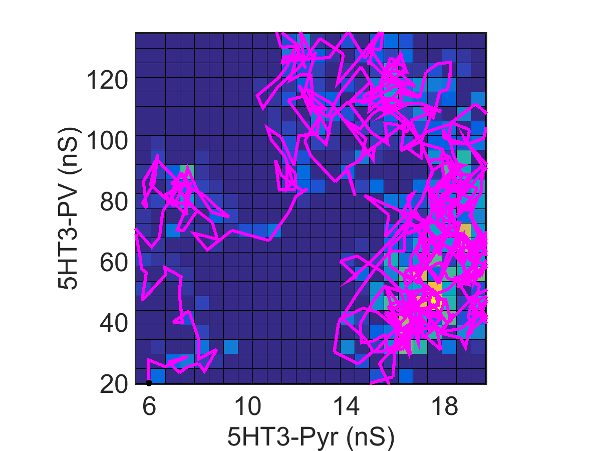

#      Markov Chain Monte Carlo Simulation for Estimation of Optimal Synaptic Parameters in a Neuronal Microcircuit        #

This is a simulation of network of biophysically realistic neurons in CA1 hippocampus.  The models are from Cutsuridis, et al. (2010).

The microcircuit is made of three types of neurons found in CA1 hippocampus: an excitatory pyramidal neuron, an inhibitory PV+, fast spiking interneuron and a disinhibitory 5HT3a+ interneuron.  All cells receive monosynaptic excitation simultaneously from a simulated excitatory axons, known as the Schaffer Collaterals. 

I use a Markov Chain Monte Carlo Simulation (MCMC) to efficiently sample the parameter space of synaptic weights, conditioned on empirically determined values of action potential probability and latency.
##	A MCMC-generated histogram of samples of synaptic parameters (more counts = more likely to fit empirical data)	##

And here is an example of a random walk that the MCMC takes in parameter space:
##	Random Walk in Synaptic Parameter Space	##

**References:**

Cutsuridis, V., Cobb, S., Graham, B.P.  Encoding and Retrieval in a Model of the Hippocampal CA1 Microcircuit.  Hippocampus, 2010.
